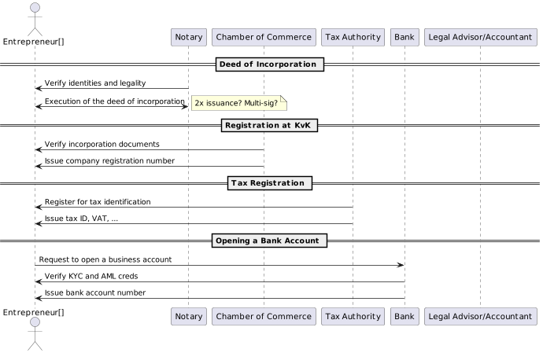

# Company Passport Architecture

This repository contains the functional and technical components, requirements and architecture for the Company Passport
project. You will need to support these specification in order for your software solution to be compatible with it.

## Project description

Company Passport is a trust framework that is evolved from an NL based innovation
project with the Dutch Chamber of Commerce, Dutch Tax Office, ABN AMRO bank,
the Royal Dutch Association of Civil-law Notaries (KNB) and the Dutch Blockchain
Coalition.
The trust framework is intended to facilitate use cases that require validated data
related to legal entities. It uses SSI (Self Sovereign Identity) technologies and should
align with the upcoming eIDAS 2 regulations. It is not a software solution but
describes how compliant software solutions interact. These software solutions can
be provided by any public or private third party.
The initial focus will address NL based use cases. However, the objective is to
assume a cross border, international context that could address all kind of different
uses cases across country borders and different domains. Company Passport work
may provide valuable input to other trust frameworks and initiatives related to
organizational digital identity. For instance the eIDAS/EUDI Wallet LSP’s, EBSI,
Gaia-X, ESG reporting (Environmental, Social, Governance), EU DPP (Digital
Product Passports), ESPR (Ecodesign for Sustainable Products Regulation), CSRD
(Corporate Sustainability Reporting Directive) etc
As part of the overall Company Passport trust framework, the architectural and
technical specifications need to be agreed upon and described. This work is caried
out by the Company Passport Architecture Working Group and documented in this
Github repository.

## Use case

As the initial use case the Architecture WG will focus on the use case of founding a
new “Besloten Vennootschap” (BV), a Dutch private limited liability company (Ltd.).
This use case acts as an example of a process that involves the exchange of
company data between a range of stakeholders, the company and its founders and
employees. However, the objective is to provide a generic trust framework and
architecture that can also be applied to other use cases and with different credentials
and stakeholders. During the course of the project additional example use cases
may be added.

### Example interactions

1. **Notary Verification & Incorporation Deed**:
   Company representatives present statutes to a notary, who verifies stakeholder identities and statutes legality, then
   **issues the deed of incorporation**, formalizing company establishment.

2. **Chamber of Commerce Registration**:
   The company submits incorporation documents to the Chamber of Commerce (KVK), which verifies and approves these
   documents, issuing a company registration number and formally registering the company.

3. **Tax Registration**:
   The company applies for tax identification and VAT registration with the Tax Authority (Belastingdienst), which
   verifies the company's legal status and tax eligibility to ensure national tax regulation compliance.

4. **Bank Account Opening**:
   The company approaches a bank to open a business account, necessary for financial transactions. The bank conducts KYC
   and AML checks to ensure financial regulation compliance before account creation.

## Scope

The current scope of the project is to incorporate a new Dutch corporation with the Chamber of Commerce (
KvK), using a 'BV' as legal entity.
The corporation also referred to as company later, will have multiple directors and will get at least 10 employees.
A Notary (KNB) is managing the screening and validation of the new corporations and its future directors and supporting
the incorporation process. After the corporation is registered with the KvK, the registration with
the Tax Office (Belastingdienst) needs to happen. The Tax Office will issue a TAX/RSIN number.
Once the corporations is incorporated with the KvK, the directors open a bank account for the corporation.

## Credential Types

Below an overview of verifiable credentials that are required during the founding of a
private limited liability company in the Netherlands (“BV”). This list may not be
exhaustive. The Architecture WG will not define the details of the data models
(schemes) for each of these credentials. A generic json schema file is assumed for
each of the credentials. The Company Passport Trust Framework Working Group is
provide data models for the various credentials.

### Incorporation Deed

“Oprichtingsakte” in Dutch. Company representatives present statutes to a
notary, who verifies stakeholder identities and statutes legality, then issues the
deed of incorporation, formalizing company establishment.

### Chamber of Commerce Number

“KVK nummer” in Dutch. Incorporation documents are provided to the
Chamber of Commerce (KVK), which verifies and approves these documents,
issuing a company registration number and formally registering the company.

### RSIN

An identification number for legal entities and partnerships issued by the
Dutch Chamber of Commerce to a legal entity. The RSIN is automatically
provided to the Dutch Tax Office who uses the RSIN to generate other
identifiers. Not all Dutch legal entities get an RSIN For instance sole
proprietorship (“eenmanszaak”).

### VAT ID

In Dutch “BTW ID”. The company applies for tax identification and VAT
registration with the Tax Authority (Belastingdienst), which verifies the
company&#39;s legal status and tax eligibility to ensure national tax regulation
compliance.

### Bank Account Number

The company approaches a bank to open a business account, necessary for
financial transactions. The bank conducts KYC and AML checks to ensure
financial regulation compliance before account creation. During this KYC and
AML checks above mentioned (re-usable) verifiable credentials are requested
acting as legitime proof of checks already done by other trusted parties.

## Glossary

### Company passport

Trust framework (“Afsprakenstelsel”) to facilitate the exchange of verifiable
data about legal entities. [More info](https://dutchblockchaincoalition.org/en/use-cases-2/ondernemingspaspoort-1).

### Organizational wallet

Software component, acting on behalf of an organization (any legal entity),
capable of receiving and storing verifiable credentials (VCs), issuing
(generating) VCs, verifying VCs and presenting verifiable presentations (VPs)
based on those VCs. Most often a web based application that can be used
multiple persons within an organization. But may also be a mobile
(iOS/Android) app.

### Personal wallet(s)

Software component, acting on behalf of a natural person, capable of
receiving and storing verifiable credentials (VCs), issuing (generating) self-
issued VCs, verifying VCs and presenting verifiable presentations (VPs)
based on those VCs. Most often a mobile (iOS/Android) app but may also be
a web based application.

### Process Guidance System

In previous phases of the Company Passport project the term “Process
Guidance System” (PGS) has often been used. It refers to a web application
or mobile app that guides people through particular processes. For instance,
the founding of a company. During the process PGS application interacts with
organizational and/or personal wallets to request or exchange verifiable
credentials. From an architectural perspective a PGS application is
considered as any relying party system that is requesting the presentation of
particular verifiable credentials. In case a verifiable credential is not yet
available the PGS can redirect to issuers of the verifiable credential.
