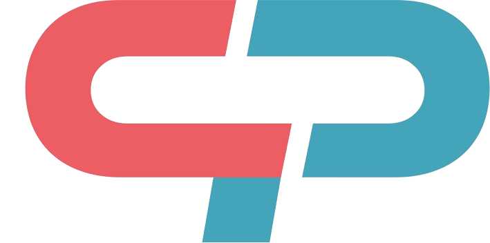

<div align="center">
   
</div>

<h1 align="center"><b>Company Passport</b></h1>

> [!TIP]
> For a live version of this documentation, see [https://dutchblockchaincoalition.github.io/CompanyPassport](https://dutchblockchaincoalition.github.io/CompanyPassport)**

This repository contains the source code of the documentation for the Company Passport project.

## Contribution Guideline

The documentation is built using a static site generator ([Nextra](https://nextra.site/)) and hosted on [GitHub Pages](https://pages.github.com/) for better readability. You can make contributions to this documentation by forking the repository, making the changes and opening a PR. Once your the PR is accepted the site is automatically built and deployed.

### Local environment setup

In order to preview the changes you make, you will need to run the development website. First, make sure you have Node.JS and Yarn v1 installed:

- [Node.JS 18+](https://nodejs.org/en/download)
- [Yarn v1](https://classic.yarnpkg.com/lang/en/docs/install)

Once you have installed Node.JS and Yarn, clone the repo, and install the dependencies:

```console
git clone https://github.com/dutchblockchaincoalition/CompanyPassport.git
yarn install
```

### Running Local Server

Once you have setup all prerequisites and installed the needed dependencies, you can start the development server:

```console
yarn dev
```

You can now view the documentation site locally by going to `http://localhost:3000/CompanyPassport`. Any changes you make will reload the site so you see the most up to date version. 

### Structure

When the site is deployed, the url routing is generated based on the directory structure of the `/pages` directory.

Some examples:

- The `/pages/index.md` file will be deployed at `https://dutchblockchaincoalition.github.io/CompanyPassport`
- The `/pages/functions/index.mdx` file will be deployed at `https://dutchblockchaincoalition.github.io/CompanyPassport/functional`
- The `/pages/functional/components.mdx` file will be deployed at `https://dutchblockchaincoalition.github.io/CompanyPassport/functional/components`

### PlantUML Diagrams

PlantUML is a scripting language for creating software diagrams by writing code. This has various benefits, including simplified version management. Most markdown renderers have no native support for rendering PlantUML diagrams and rendering a diagram therefore usually requires the author to manually export the image. This can become quite tedious and lead to version mismatches between the diagram source code and rendered image. Luckily, GitHub Actions can help us out.

During the build process, all source files within the `/docs/assets` directory that end with `.puml` are compiled to an `.svg` file. This means that order to include your diagram into your document, you will have to use the `.svg` extension.