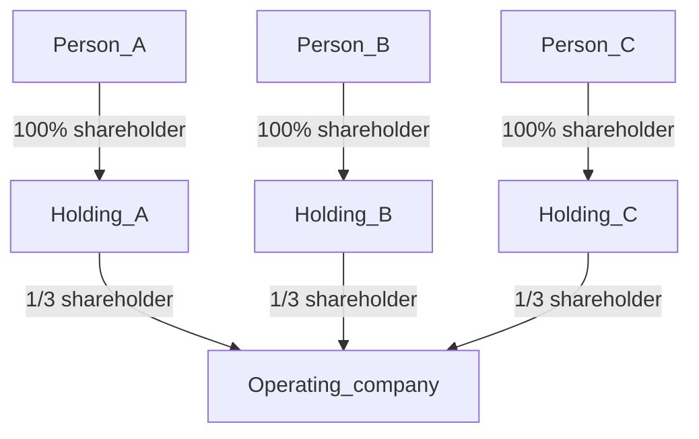
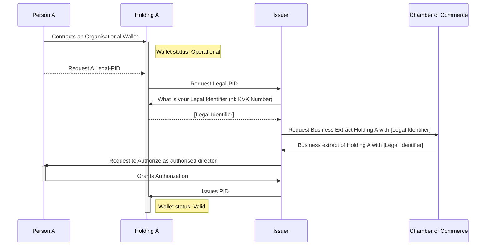
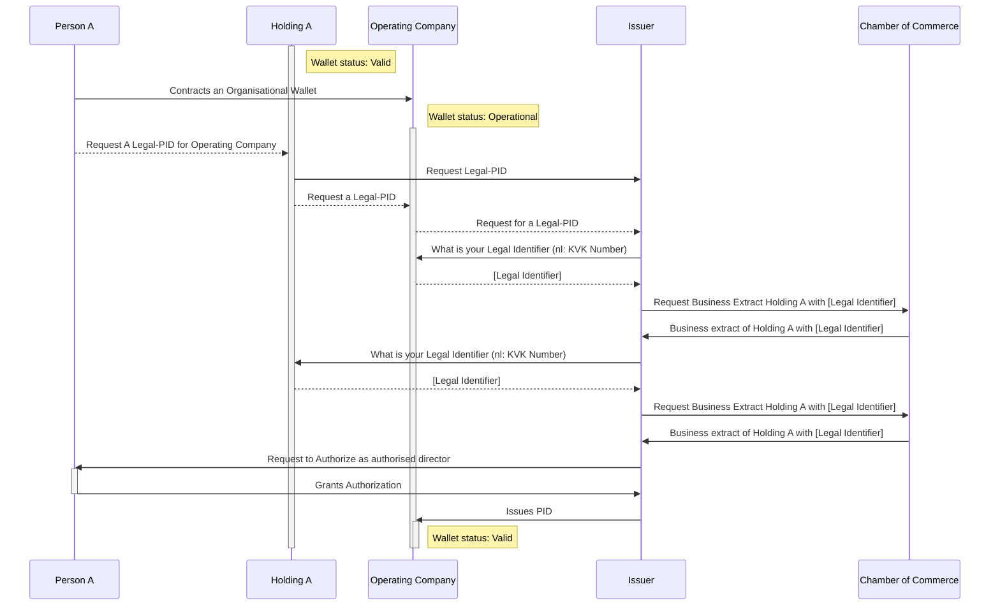

## Organization structure

## Scope Use Case

### Operating_company 
  - Has an organisational wallet
  - Has 3 independently authorised directors:
    - Holding A
    - Holding B
    - Holding C
  - Has 3 shareholders:
     - 1/3 Holding A
     - 1/3 Holding B
     - 1/3 Holding C
### Holding A
  - Has an organisational wallet
  - Has 1 independently authorised director:
    - Person A
  - Has 1 100% shareholder
    - Person A
### Person A
  - Has a personal wallet
### Holding B
  - Has an organisational wallet
  - Has 1 independently authorised director:
    - Person B
  - Has 1 100% shareholder
    - Person B
### Person B
  - Does not have a personal wallet
  - Has an eIDAS High Digital Identity
### Holding C
  - Does not have an organizational wallet
  - Has 1 independently authorized director:
    - Person C
  - Has 1 100% shareholder
    - Person C
### Person C
  - Does not have a personal wallet
  - Has an eIDAS High Digital Identity

## Flow use case Horizon 1

### PID Issuance to Holding A

### PID Issuance to Operating Company

