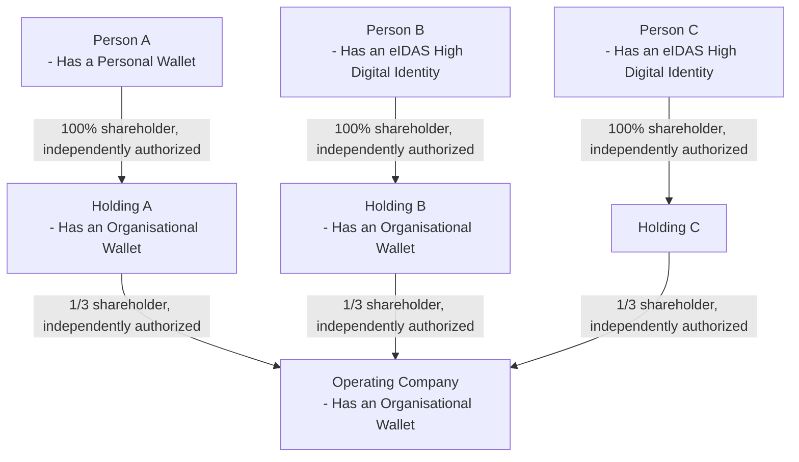
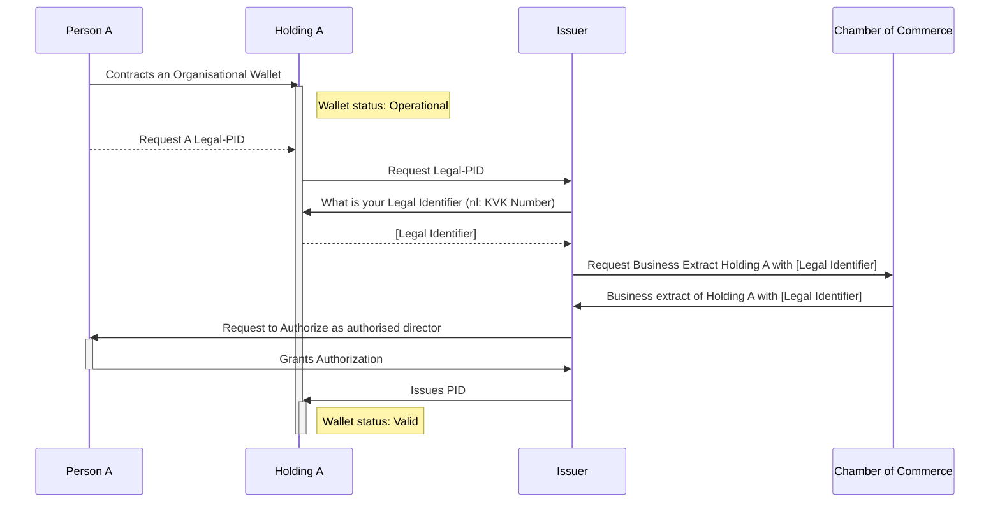
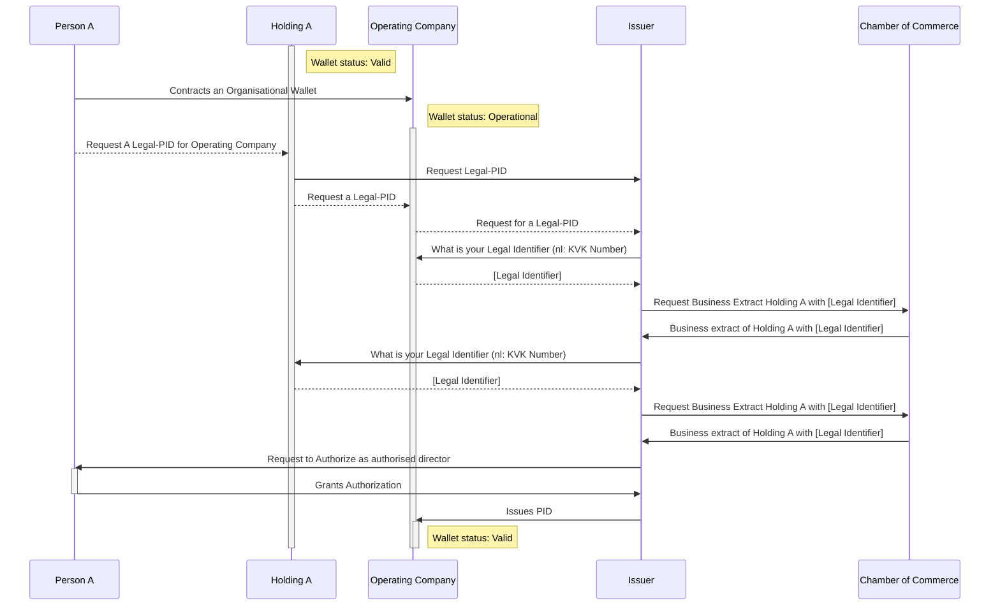

import { Kicker } from '@components/Kicker'
import { Title } from '@components/Title'
import { Caption } from '@components/Caption'

<Kicker variant="accent">Use case</Kicker>
<Title size="large" variant="primary">
  Founding a Company
</Title>

The current scope of the project is to incorporate a new Dutch corporation with the Chamber of Commerce (KvK), using a 'BV' as legal entity.

The corporation also referred to as company later, will have multiple directors and will get at least 10 employees.
A Notary (KNB) is managing the screening and validation of the new corporations and its future directors and supporting
the incorporation process. After the corporation is registered with the KvK, the registration with
the Tax Office (Belastingdienst) needs to happen. The Tax Office will issue a TAX/RSIN number.
Once the corporations is incorporated with the KvK, the directors open a bank account for the corporation.

## Example interactions

1. **Notary Verification & Incorporation Deed**:
   Company representatives present statutes to a notary, who verifies stakeholder identities and statutes legality, then
   **issues the deed of incorporation**, formalizing company establishment.

2. **Chamber of Commerce Registration**:
   The company submits incorporation documents to the Chamber of Commerce (KVK), which verifies and approves these
   documents, issuing a company registration number and formally registering the company.

3. **Tax Registration**:
   The company applies for tax identification and VAT registration with the Tax Authority (Belastingdienst), which
   verifies the company's legal status and tax eligibility to ensure national tax regulation compliance.

4. **Bank Account Opening**:
   The company approaches a bank to open a business account, necessary for financial transactions. The bank conducts KYC
   and AML checks to ensure financial regulation compliance before account creation.

<Caption>Use case sequence diagram</Caption>

See the [Glossary](/glossary) for definitions of terms used in this document.

## Credential Types

Below an overview of verifiable credentials that are required during the founding of a
private limited liability company in the Netherlands (“BV”). This list may not be
exhaustive. The Architecture WG will not define the details of the data models
(schemes) for each of these credentials. A generic json schema file is assumed for
each of the credentials. The Company Passport Trust Framework Working Group task is to provide data models for the various credentials.

### Incorporation Deed

“Oprichtingsakte” in Dutch. Company representatives present statutes to a
notary, who verifies stakeholder identities and statutes legality, then issues the
deed of incorporation, formalizing company establishment.

### Chamber of Commerce Number

“KVK nummer” in Dutch. Incorporation documents are provided to the
Chamber of Commerce (KVK), which verifies and approves these documents,
issuing a company registration number and formally registering the company.

### RSIN

An identification number for legal entities and partnerships issued by the
Dutch Chamber of Commerce to a legal entity. The RSIN is automatically
provided to the Dutch Tax Office who uses the RSIN to generate other
identifiers. Not all Dutch legal entities get an RSIN (for example sole proprietorship (“eenmanszaak”)).

### VAT ID

In Dutch “BTW ID”. The company applies for tax identification and VAT
registration with the Tax Authority (Belastingdienst), which verifies the
company's legal status and tax eligibility to ensure national tax regulation
compliance.

### Bank Account Number

The company approaches a bank to open a business account, necessary for
financial transactions. The bank conducts KYC and AML checks to ensure
financial regulation compliance before account creation. During this KYC and
AML checks above mentioned (re-usable) verifiable credentials are requested
acting as legitimate proof of checks already done by other trusted parties.

## Scope Use Case

## Flow use case Horizon 1

### PID Issuance to Holding A

### PID Issuance to Operating Company

