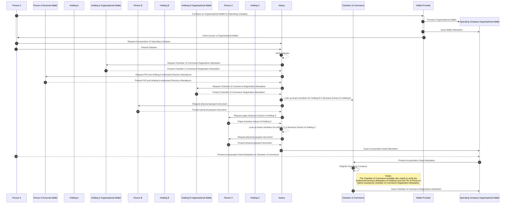

import { Kicker } from '@components/Kicker'
import { Title } from '@components/Title'
import { Caption } from '@components/Caption'

<Kicker variant="accent">Use case</Kicker>
<Title size="large" variant="primary">
  Founding a Company
</Title>

The current scope of the project is to incorporate a new Dutch corporation with the Chamber of Commerce (KvK), using a 'BV' as legal entity.

The corporation also referred to as company later, will have multiple directors and will get at least 10 employees.
A Notary (KNB) is managing the screening and validation of the new corporations and its future directors and supporting
the incorporation process. After the corporation is registered with the KvK, the registration with
the Tax Office (Belastingdienst) needs to happen. The Tax Office will issue a TAX/RSIN number.
Once the corporation is incorporated with the KvK, the directors open a bank account for the corporation.

The below organizational structure represents a common structure for a Dutch Legal Entity. Where each director of the
operating company has it's own personal Holding Legal Entity. The current scope is to faciliate the structure as documented
in the diagram below for incorporating a new Legal Entity.

<Caption>Organizational structure for the use case of founding a company.</Caption>

## Example interactions

1. **Notary Verification & Incorporation Deed**:
   Company representatives present statutes to a notary, who verifies stakeholder identities and statutes legality, then
   **issues the [Incorporation Deed](#incorporation-deed) Attestation**, formalizing company establishment.

2. **Chamber of Commerce Registration**:
   The company submits incorporation documents to the Chamber of Commerce (KVK), which verifies and approves these
   documents, issuing a [Chamber of Commerce Registration](#chamber-of-commerce-registration) Attestation and formally registering the company.

3. **Tax Registration**:
   The company applies for tax identification and VAT registration with the Tax Authority (Belastingdienst), which
   verifies the company's legal status and tax eligibility to ensure national tax regulation compliance.

4. **Bank Account Opening**:
   The company approaches a bank to open a business account, necessary for financial transactions. The bank conducts KYC
   and AML checks to ensure financial regulation compliance before account creation.

<Caption>Use case sequence diagram</Caption>

See the [Glossary](/glossary) for definitions of terms used in this document.

## Attestation Types

Below an overview of attestations that are required during the founding of a
private limited liability company in the Netherlands (“BV”). This list may not be
exhaustive. The Architecture WG will not define the details of the data models
(schemes) for each of these attestations. A generic json schema file is assumed for
each of the attestation. The Company Passport Trust Framework Working Group task is
to provide data models for the various attestations.

### Incorporation Deed

“Oprichtingsakte” in Dutch. Company representatives present statutes to a
notary, who verifies stakeholder identities and statutes legality, then issues the
deed of incorporation, formalizing company establishment.

### Chamber of Commerce Registration

"Uitreksel" in Dutch. Incorporation documents are provided to the
Chamber of Commerce (KVK), which verifies and approves these documents,
issuing a company registration attestation and formally registering the company.
The attestion will include the Chamber of Commerce Number (KVK Nummer) and the RSIN.
Not all Dutch legal entities get an RSIN, for example sole proprietorship (“eenmanszaak”).

The RSIN is an identification number for legal entities and partnerships issued by the
Dutch Chamber of Commerce to a legal entity. The RSIN is automatically
provided to the Dutch Tax Office who uses the RSIN to generate other
identifiers.

### Chamber of Commerce Authorised Director

In the current "Uitreksel" creatd by the Chamber of Commerce, Authorised Directors are listed directly. For the Company Passport,
an authorised director for a legal entity can get an Authorised Director Attestation issued to their personal wallet.
The Authorised Director Attestation will link to the Chamber of Commerce Number. Only full power of
attorney Authorised Directory Attestations are within the scope of the current Founding a Company use case.

### VAT ID

In Dutch “BTW ID”. The company applies for tax identification and VAT
registration with the Tax Authority (Belastingdienst), which verifies the
company's legal status and tax eligibility to ensure national tax regulation
compliance.

### Bank Account

The company approaches a bank to open a business account, necessary for
financial transactions. The bank conducts KYC and AML checks to ensure
financial regulation compliance before account creation. During this KYC and
AML checks above mentioned (re-usable) attestations are requested
acting as legitimate proof of checks already done by other trusted parties.

## Detailed Flow

This section gives a more detailed overview of the flows that will be required for incorporating a new
Legal Entity, based on the organisational structure as defined above.

The following is assumed as a starting point for these flows:

- Person A has a personal wallet with a PID.
- Operating Company does not exist yet
- Holding A, B & C already exist, but do not have organizational wallets or attestations yet.

### Holding A Organisational Wallet initalisation

This flow covers the following:

- Person A contracts an Organisational Wallet for Holding A from a Wallet Provider
- Person A requests a ["Chamber of Commerce Registration"](#chamber-of-commerce-registration) Attestation from the Chamber of Commerce from Holding A Organisataional Wallet

### Incorporation of Operating Company

This flow covers the following:

- Person A contracts an Organisational Wallet for Operating Company from a Wallet Provider
- Incorporate Operating Company at the Notary and receive an ["Incorporation Deed"](#incorporation-deed) Attesstation from the Notary.
- Present the ["Incorporation Deed"](#incorporation-deed) Attestation to the Chamber of Commerce and receive a ["Chamber of Commerce Registration"](#chamber-of-commerce-registration) Attestion from the Chamber of Commerce.

> NOTE: the diagram is still a work in process and needs some details cleared up

### Tax Registration for Operating Company at the Tax Office

> This diagram will be added soon

### Operating Company opens a bank account

> This diagram will be added soon
